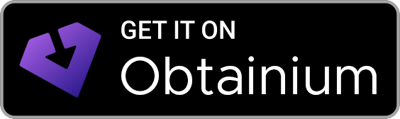
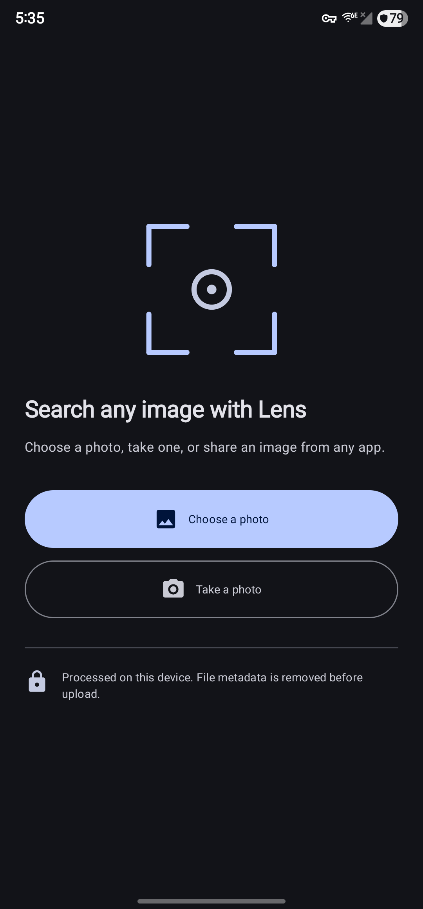
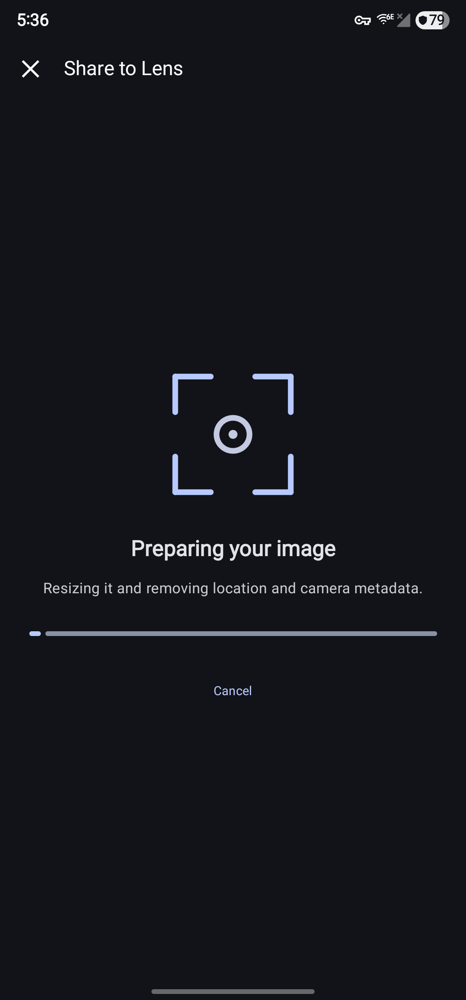
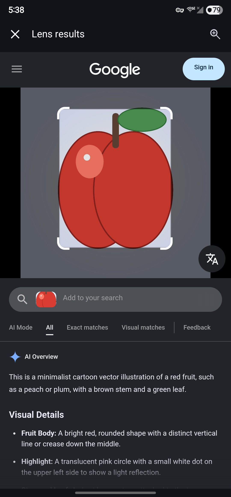

# Share to Lens

**Google Lens from Android's share sheet. No Google app required.**

Share an image from any app, or open Share to Lens to choose or take a photo.
The app resizes the image, removes file metadata, sends the processed copy to
Google Lens, and opens the result.

<p>
  <a href="https://github.com/Nulifyer/ShareToLens/releases/latest"></a>
  &nbsp;
  <a href="https://apps.obtainium.imranr.dev/redirect?r=obtainium%3A%2F%2Fadd%2Fhttps%3A%2F%2Fgithub.com%2FNulifyer%2FShareToLens"></a>
</p>

<!-- Badges are trimmed copies of the assets used by Obtainium's official project and badge guide. -->


[](LICENSE)

## See it work

<p align="center">
  
  &nbsp;
  
  &nbsp;
  
</p>

## Why use it?

- Share an image straight from your browser, gallery, file manager, or chat app.
- Choose or take a photo when you open Share to Lens directly.
- Keep the Google app off your phone.
- Grant no camera, location, or photo-library permission.
- Remove GPS, camera, timestamp, and other file metadata before upload.
- Leave no search history or analytics database inside the app.

## How it works

1. Share, choose, or take an image.
2. Share to Lens resizes it to at most 2048 pixels on its longest edge and
   writes a fresh JPEG without the original file metadata.
3. The app uploads that temporary JPEG to Google Lens and opens the result in
   a restricted in-app browser.

Tap **New search** from a result to choose another image. Back moves through
Lens pages first. At the first result, Back returns to the chooser if you
opened the app directly, or to the source app if you used Android's share
sheet.

## Privacy

Share to Lens asks only for internet access. Android grants temporary access
to the one image you choose or share, so the app does not need access to your
photo library.

The processed image is sent to Google. Removing metadata does not hide visible
faces, text, landmarks, addresses, or other clues inside the picture. Google
handles the uploaded image and normal web request information under its own
terms and privacy policy.

Share to Lens contains no analytics or advertising SDK. Temporary image files
are deleted after use. Browser data is cleared at the start and normal end of
a session, with stale temporary files cleaned after an interrupted session.
Read [PRIVACY.md](PRIVACY.md) for the exact behavior and limitations.

## Install and update

Download `ShareToLens-vX.Y.Z.apk` and its checksum from
[GitHub Releases](https://github.com/Nulifyer/ShareToLens/releases). Each
release also includes the APK signing-certificate report and a GitHub build
provenance attestation.

For automatic update checks, add this repository to
[Obtanium](https://github.com/ImranR98/Obtainium) and use:

```text
ShareToLens-.*\.apk$
```

Keep prereleases disabled unless you want test builds. If you previously
installed a debug build, uninstall it before installing a release. Android
treats debug and release signatures as different apps.

## Limits

Share to Lens uses Google's public Lens web upload flow. Google does not
provide this app with an official Lens API, and a change to the web flow can
temporarily break uploads.

## Development

The repository requires JDK 17, Android SDK Platform 37, and Android SDK Build
Tools 36.0.0. The Gradle wrapper is committed so every environment uses the
same Gradle release. The Android SDK itself is not part of the repository.
Install it with Android Studio, Google's command-line tools, or your operating
system's package manager.

Run the same checks as CI:

```bash
./gradlew testDebugUnitTest lintDebug assembleDebug
```

Run the metadata and Compose tests on a connected API 29 or newer device:

```bash
./gradlew connectedDebugAndroidTest
```

Release signing and verification are documented in
[docs/release.md](docs/release.md).
